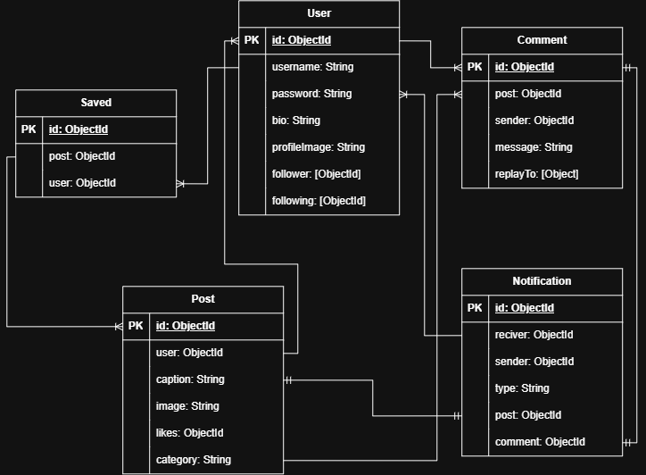

# BEELIE Backend API

## Overview

This repository contains a RESTful API for a BEELIE it is a blog dedicated only for girls. 

## Related Links
- Backend API: [Deployed Backend URL](https://project-3-backend-fl7z.onrender.com)
- Frontend Application: [Deployed Frontend URL](https://beelie.netlify.app/)
- Frontend Repository: [Frontend Repository URL](https://github.com/RaghadHussain/project-3-frontend)

## Technologies Used

1. Node.js
2. Express
3. MongoDB
4. Mongoose
5. JavaScript
6. dotenv
7. Morgan
8. JSON Web Tokens
9. bcrypt (password hashing)
10. Multer (image uploads)

## Project Structure

```
backend/
├── .github/
├── config/
├── controllers/
├── middleware/
├── models/
├── routes/
├── tests/
├── uploads/
├── app.js
└── server.js
```

| Folder | Purpose |
| --- | --- |
| config | Database connection setup |
| controllers | HTTP request and response handling |
| middleware | Authentication, file upload, and validation middleware |
| models | Mongoose schemas and models |
| routes | Express route definitions |
| tests | Automated tests |
| uploads | Stored user-uploaded images |
| app.js | Express application configuration |
| server.js | Database connection and server startup |

## Getting Started

### Prerequisites

Install:

- Node.js
- MongoDB locally or a MongoDB Atlas account

## Installation

1. Clone the Repository:
   ```
   git clone https://github.com/RaghadHussain/project-3-backend

   cd project-3-backend
   ```
2. Install Dependencies:
   ```
   npm i
   ```
3. Create a `.env` File in the Project Root with:
   ```
   PORT = 3000
   MONGODB_URI = your MongoDB connection string
   JWT_SECRET = any secret string
   CLIENT_URL = http://localhost:5173
   ```
4. Start the App:
   ```
   npm run dev
   ```
5. Visit `http://localhost:3000` in Your Browser.

## Database Models

### User

| Field | Type | Rules |
| --- | --- | --- |
| username | String | Required, unique, trimmed, lowercase |
| hashedPassword | String | Required, hashed with bcrypt |
| bio | String | Trimmed, max 250 characters |
| profileImage | String | Optional |
| followers | [ObjectId] (ref: User) | |
| followings | [ObjectId] (ref: User) | |
| createdAt / updatedAt | Date | Generated automatically |

### Post

| Field | Type | Rules |
| --- | --- | --- |
| user | ObjectId (ref: User) | |
| title | String | Trimmed, max 20 characters |
| caption | String | Trimmed, max 2000 characters |
| image | String | Optional |
| category | String | Enum: fashion, skincare, lifestyle, hobbies |
| likes | [ObjectId] (ref: User) | |
| createdAt / updatedAt | Date | Generated automatically |

### Comment

| Field | Type | Rules |
| --- | --- | --- |
| post | ObjectId (ref: Post) | |
| sender | ObjectId (ref: User) | |
| message | String | Required, trimmed, 1-500 characters |
| replyTo | [Reply subdocument] | Each reply has `post`, `sender`, and `message` |
| createdAt / updatedAt | Date | Generated automatically |

### Notification

| Field | Type | Rules |
| --- | --- | --- |
| reciver | ObjectId (ref: User) | |
| sender | ObjectId (ref: User) | |
| type | String | Enum: like, comment, follow |
| post | ObjectId (ref: Post) | Optional |
| comment | ObjectId (ref: Comment) | Optional |
| createdAt / updatedAt | Date | Generated automatically |

### Save

| Field | Type | Rules |
| --- | --- | --- |
| user | ObjectId (ref: User) | |
| post | ObjectId (ref: Post) | |
| createdAt / updatedAt | Date | Generated automatically |

## Entity Relationships


## API Base URL

Local development:
```
http://localhost:3000
```

Production:
```
Deployed Backend URL
```

## Endpoints

### Authentication

| Method | Endpoint | Access | Description |
| --- | --- | --- | --- |
| POST | /auth/sign-up | Public | Register a new user (accepts `profileImage` upload) |
| POST | /auth/sign-in | Public | Log in a user and receive a JWT |
| GET | /auth/me | Authenticated | Get the currently authenticated user |
| GET | /auth/user/:id | Authenticated | Get a user by ID |
| PUT | /auth/user/:id | Owner | Update your own user info (accepts `profileImage` upload) |
| POST | /auth/user/:id/follow | Authenticated | Follow a user |
| POST | /auth/user/:id/unfollow | Authenticated | Unfollow a user |
| GET | /auth/search | Public | Search for users by username |

### Posts

| Method | Endpoint | Access | Description |
| --- | --- | --- | --- |
| POST | /post | Authenticated | Create a new post (accepts `image` upload) |
| GET | /post | Public | Get all posts |
| GET | /post/user/:id | Authenticated | Get all posts by a specific user |
| GET | /post/:id | Public | Get one post |
| PUT | /post/:id | Authenticated | Update a post |
| DELETE | /post/:id | Authenticated | Delete a post |
| POST | /post/like/:id | Authenticated | Like a post |
| POST | /post/:id/unlike | Authenticated | Unlike a post |

### Comments

| Method | Endpoint | Access | Description |
| --- | --- | --- | --- |
| GET | /comment/:id | Public | Get all comments for a post |
| POST | /comment | Authenticated | Create a new comment |
| PUT | /comment/:id | Owner | Update your own comment |
| DELETE | /comment/:id | Owner | Delete your own comment |
| POST | /comment/:id/replies | Authenticated | Add a reply to a comment |
| PUT | /comment/:id/replies/:replyId | Owner | Update your own reply |
| DELETE | /comment/:id/replies/:replyId | Owner | Delete your own reply |

### Notifications

| Method | Endpoint | Access | Description |
| --- | --- | --- | --- |
| GET | /notification | Authenticated | Get notifications for the authenticated user |

### Saved Posts

| Method | Endpoint | Access | Description |
| --- | --- | --- | --- |
| POST | /save | Authenticated | Save a post |
| GET | /save | Authenticated | Get all saved posts for the authenticated user |
| GET | /save/:id | Authenticated | Get a saved post by ID |
| DELETE | /save/:id | Authenticated | Remove a post from saved |


## Status Codes

| Status | Meaning in this API |
| --- | --- |
| 200 | Successful request |
| 201 | Resource created |
| 400 | Invalid request |
| 401 | Authentication required or invalid |
| 403 | Authenticated but not permitted |
| 404 | Resource not found |
| 409 | Resource conflict |
| 500 | Unexpected server error |


## Features

- User authentication with JWT and bcrypt-hashed passwords
- User profiles with bio and profile image, updatable by their owner
- Follow / unfollow other users
- Username search
- Create, edit, and delete posts, each with an optional image upload
- Like / unlike posts
- Comment on posts, with threaded replies
- Editing/deleting comments and replies restricted to their original author
- Save / unsave posts to a personal saved-posts list
- Notifications generated for likes, comments, and follows
- Image uploads handled via Multer and served from `/uploads`


## Team Members

| Name | GitHub |  |
| --- | --- | --- |
| Raghad Husain | [Raghad Github Profile](https://github.com/RaghadHussain)| 
| Zainab Ali Ammar | [Zainab Github Profile](https://github.com/zainabaliammarali-cloud) | 

## Credits

Special thanks to Mr. Omer, our Lead Instructor, and Mr. Zaid, our Assistant Instructor without their support and efforts this project wouldn't have come together.
